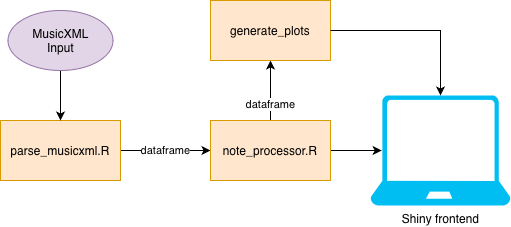
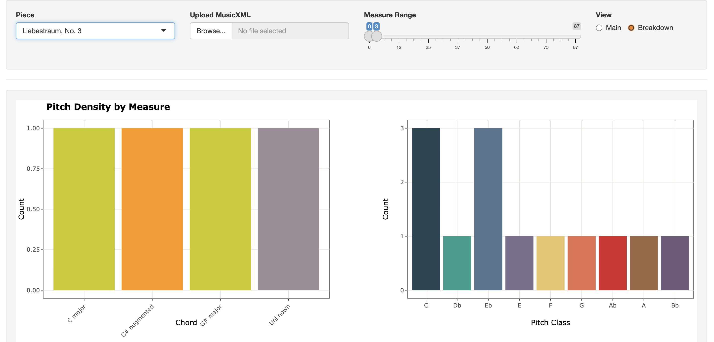

# r_harmony

Shiny app for loading MusicXML piano scores, rendering selected measures, and showing simple chord / pitch summaries. Written only in R, with exception of OSMD library for sheet rendering.

## Setup

- Run `source("install_packages.R")` to install required packages
- Run `runApp("app.R")` to start application

## File Structure

- `app.R`: main Shiny app
- `install_packages.R`: installs required R packages
- `R/parse_musicxml.R`: parses MusicXML into a note-level data frame
- `R/note_processor.R`: builds measure-level summaries and chord labels
- `R/generate_plots.R`: plotting helpers for the breakdown view
- `R/sheet_drawer.R`: OSMD score rendering helpers
- `sheets/`: sample MusicXML files used by the app

Written for COMPFOR 133 at UMich.
